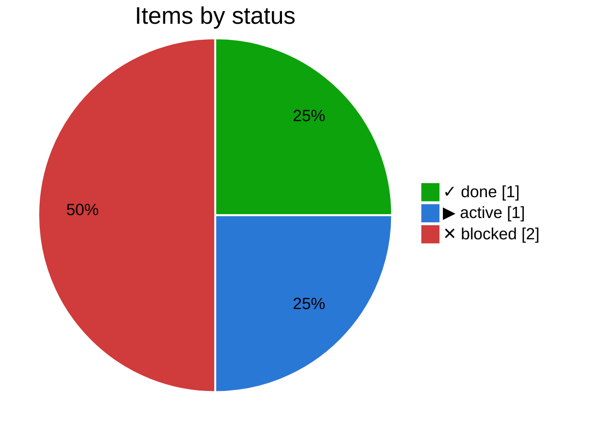

The server side: schema, API and tokens.

<!-- pm:progress -->
**50% done** · ✓ 1 done · ▶ 1 active · ○ 0 ready · ✕ 2 blocked · [review](../progress/backend.md)

```mermaid
%%{init: {"themeVariables": {"pie1": "#0ca30c", "pie2": "#2a78d6", "pie3": "#d03b3b", "pieOpacity": "1", "pieSectionTextColor": "#000", "pieStrokeColor": "#fff", "pieStrokeWidth": "2px", "pieOuterStrokeWidth": "0px"}}}%%
pie showData title Items by status
  "✓ done" : 1
  "▶ active" : 1
  "✕ blocked" : 2
```
<!-- /pm:progress -->
